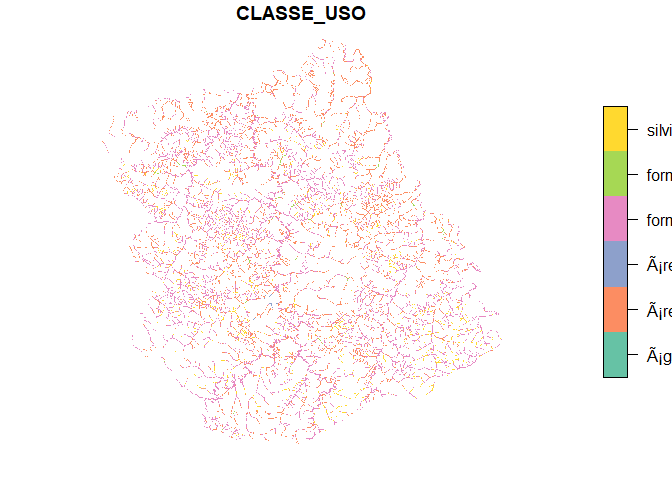

# Introdução

Nesse script buscamos identificar e quantificar as APPs que necessitam ser restauradas em Buri.

Exploramos um pouco as funções do pacote **sf**
# Setup, instala e carrega pacotes


```r
inline_hook <- function(x) {
  if (is.numeric(x)) {
    format(x, digits = 2)
  } else x
}
knitr::knit_hooks$set(inline = inline_hook)
```


```r
require(rgdal)
require(sf)
```
# Carrega os mapas e verifica dados

Carrega os mapas

```r
BURI_app_uso<-readOGR(dsn="./data_use",layer="SP_3508009_APP_USO")
```

```
## Warning in OGRSpatialRef(dsn, layer, morphFromESRI =
## morphFromESRI, dumpSRS = dumpSRS, : Discarded datum
## Sistema_de_Referencia_Geocentrico_para_America_del_Sur_1995 in CRS definition:
## +proj=utm +zone=22 +south +ellps=GRS80 +towgs84=0,0,0,0,0,0,0 +units=m +no_defs
```

```
## OGR data source with driver: ESRI Shapefile 
## Source: "C:\Users\santo\Documents\GitHub\APP_ALPA\data_use", layer: "SP_3508009_APP_USO"
## with 17 features
## It has 6 fields
```

```r
BURI_app<-readOGR(dsn="./data_use",layer="SP_3508009_APP")
```

```
## Warning in OGRSpatialRef(dsn, layer, morphFromESRI =
## morphFromESRI, dumpSRS = dumpSRS, : Discarded datum
## Sistema_de_Referencia_Geocentrico_para_America_del_Sur_1995 in CRS definition:
## +proj=utm +zone=22 +south +ellps=GRS80 +towgs84=0,0,0,0,0,0,0 +units=m +no_defs
```

```
## OGR data source with driver: ESRI Shapefile 
## Source: "C:\Users\santo\Documents\GitHub\APP_ALPA\data_use", layer: "SP_3508009_APP"
## with 5 features
## It has 7 fields
## Integer64 fields read as strings:  GEOCODIGO
```

```r
BURI_uso<-readOGR(dsn="./data_use",layer="SP_3508009_USO")
```

```
## Warning in OGRSpatialRef(dsn, layer, morphFromESRI =
## morphFromESRI, dumpSRS = dumpSRS, : Discarded datum
## Sistema_de_Referencia_Geocentrico_para_America_del_Sur_1995 in CRS definition:
## +proj=utm +zone=22 +south +ellps=GRS80 +towgs84=0,0,0,0,0,0,0 +units=m +no_defs
```

```
## OGR data source with driver: ESRI Shapefile 
## Source: "C:\Users\santo\Documents\GitHub\APP_ALPA\data_use", layer: "SP_3508009_USO"
## with 6 features
## It has 6 fields
```
Verifica APP_USO

```r
head(BURI_app_uso@data)
```

```
##   GEOCODIGO MUNICIPIO UF CD_UF        CLASSE_USO  AREA_HA
## 0   3508009      BURI SP    35 área antropizada  4749.02
## 1   3508009      BURI SP    35 área antropizada  6597.62
## 2   3508009      BURI SP    35 área antropizada  9685.66
## 3   3508009      BURI SP    35 área antropizada  5784.59
## 4   3508009      BURI SP    35 área antropizada  9409.53
## 5   3508009      BURI SP    35 área antropizada 10011.40
```

Verifica USO

```r
head(BURI_uso@data)
```

```
##   GEOCODIGO MUNICIPIO UF CD_UF                CLASSE_USO  AREA_HA
## 0   3508009      BURI SP    35                     água  1056.56
## 1   3508009      BURI SP    35         área antropizada 72686.47
## 2   3508009      BURI SP    35           área edificada   436.95
## 3   3508009      BURI SP    35      formação florestal 22215.69
## 4   3508009      BURI SP    35 formação não florestal   311.45
## 5   3508009      BURI SP    35              silvicultura 22968.99
```
Verifica APP

```r
head(BURI_app@data)
```

```
##   GEOCODIGO MUNICIPIO UF CD_UF                     HIDRO APP_M   AREA_HA
## 0   3508009      BURI SP    35   curso d'água (0 - 10m)    30 11213.200
## 1   3508009      BURI SP    35  curso d'água (10 - 50m)    50  1614.100
## 2   3508009      BURI SP    35 curso d'água (50 - 200m)   100   175.137
## 3   3508009      BURI SP    35             massa d'água    30   311.832
## 4   3508009      BURI SP    35                  nascente    50  1871.340
```
# Cálculo das APPs

Para ver o que a função de baixo vai fazer, depois pode tirar.

```r
BURI_app_sf<-as(BURI_app, "sf")#transforma em objeto sf

BURI_app_sf_cast = st_cast(BURI_app_sf,"POLYGON") #explode em 

dim(BURI_app_sf)
dim(BURI_app_sf_cast)

BURI_app_exp<-as(BURI_app_sf_cast, "Spatial")
```
Funçao para explodir de multipart para singlepart. Deixei comentado o retorno para sp, deixando em sf, pq iremos usar funcao para sf na sequencia.

```r
explode<-function(sp){
  sp_sf<-as(sp, "sf") #transforma em sf
  sp_sf_cast = st_cast(sp_sf,"POLYGON") #explode 
  #sp_explodido<-as(sp_sf_cast, "Spatial")
}
```
Roda a função

```r
BURI_app_sf<-explode(BURI_app)
```

```
## Warning in st_cast.sf(sp_sf, "POLYGON"): repeating attributes for all sub-
## geometries for which they may not be constant
```

```r
BURI_uso_sf<-explode(BURI_uso)
```

```
## Warning in st_cast.sf(sp_sf, "POLYGON"): repeating attributes for all sub-
## geometries for which they may not be constant
```

```r
BURI_app_sf<-st_buffer(BURI_app_sf, 0)
BURI_uso_sf<-st_buffer(BURI_uso_sf, 0)
```
Clipa e organiza

```r
a<-st_intersection(BURI_uso_sf, BURI_app_sf)
```

```
## Warning: attribute variables are assumed to be spatially constant throughout all
## geometries
```

```r
a.col<-st_collection_extract(a, "POLYGON")
```
## Plota resultados no mapa
Plota para ver resultados no mapa

```r
plot(a.col["CLASSE_USO"], border="transparent")
```



Calcula as áreas

```r
a.col$area<-st_area(a.col)
a.col$areaHa<-a.col$area/10000
a.col.df<-a.col
st_geometry(a.col.df)<-NULL

#head(a.col.df)
somatoria<-rowsum(a.col.df$areaHa, group=a.col.df$CLASSE_USO)
```
## Resultados quantitativos

```r
somatoria
```

```
##                                   [,1]
## água                     5.239624e-06
## área antropizada         5.812345e+03
## área edificada           1.921111e+01
## formação florestal      7.999267e+03
## formação não florestal 1.048848e+02
## silvicultura              1.249948e+03
```


```r
colSums(somatoria)
```

```
## [1] 15185.66
```

```r
sum(BURI_app@data$AREA_HA)
```

```
## [1] 15185.61
```

O total de APP a ser restaurado em Buri é de 7082 ha, o que corresponde a 47 % do total de APPs do município.

## Resultados para APP de nascente

Separando a área (ha) por tipo de APP

```r
area_nasc<-rowsum(a.col.df$areaHa, group=a.col.df$HIDRO)
```


```r
area_nasc
```

```
##                                 [,1]
## curso d'água (0 - 10m)   11213.2487
## curso d'água (10 - 50m)   1614.0983
## curso d'água (50 - 200m)   175.1365
## massa d'água               311.8316
## nascente                   1871.3410
```

Calculando o uso de solo dentro das APPs de nascente

```r
a.nasc<-a.col.df[a.col.df$HIDRO=="nascente",]
somatoria_nasc<-rowsum(a.nasc$areaHa, group=a.nasc$CLASSE_USO)
```


```r
somatoria_nasc
```

```
##                                   [,1]
## água                     6.873298e-07
## área antropizada         1.022750e+03
## formação florestal      4.674441e+02
## formação não florestal 3.171077e+00
## silvicultura              3.779762e+02
```
O total de APP, dispostas em nascentes, a ser restaurado em Buri é de 1401 ha, o que corresponde a 75 % do total de APPs presentes apenas em nascentes do município.


