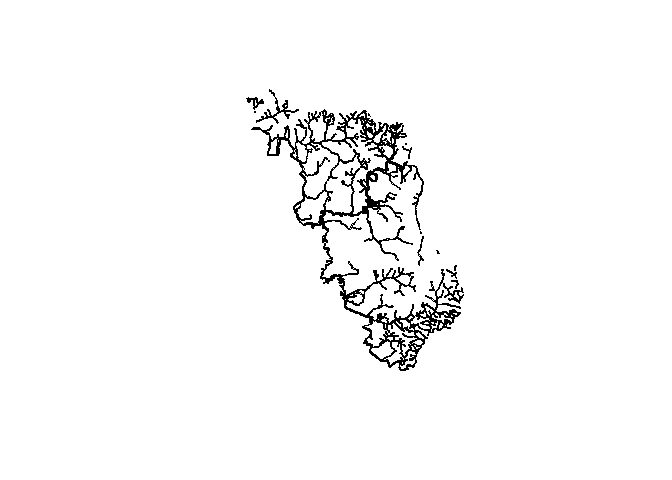
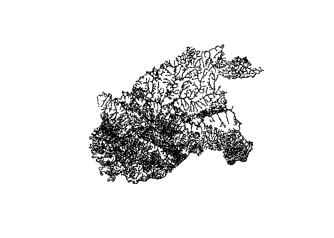
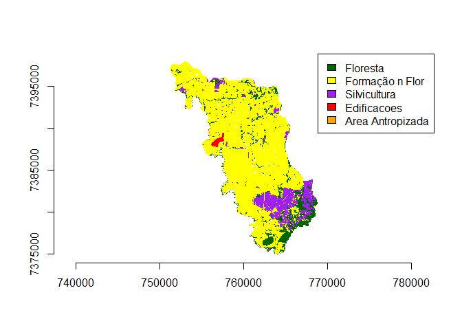
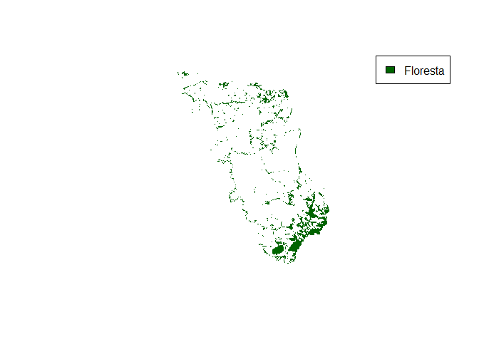

# Introdução
Aqui vamos apenas carregar os mapas baixados da semana passada e plota-los no R

# Passos
Para conseguir usar o comando para a leitura do shapefile será necessário que rgdal esteja instalado e ativo.

```r
install.packages(c('raster', 'sp', 'rgdal', 'dplyr', 'XML', 'curl'))
```

Load packages

```r
library(raster)
```

```
## Loading required package: sp
```

```r
library(sp)
library(rgdal)
```

```
## rgdal: version: 1.4-8, (SVN revision 845)
##  Geospatial Data Abstraction Library extensions to R successfully loaded
##  Loaded GDAL runtime: GDAL 2.2.3, released 2017/11/20
##  Path to GDAL shared files: C:/Users/patri/Documents/R/win-library/4.0/rgdal/gdal
##  GDAL binary built with GEOS: TRUE 
##  Loaded PROJ.4 runtime: Rel. 4.9.3, 15 August 2016, [PJ_VERSION: 493]
##  Path to PROJ.4 shared files: C:/Users/patri/Documents/R/win-library/4.0/rgdal/proj
##  Linking to sp version: 1.4-2
```

```r
library(dplyr)
```

```
## 
## Attaching package: 'dplyr'
```

```
## The following objects are masked from 'package:raster':
## 
##     intersect, select, union
```

```
## The following objects are masked from 'package:stats':
## 
##     filter, lag
```

```
## The following objects are masked from 'package:base':
## 
##     intersect, setdiff, setequal, union
```

```r
library(XML)
library(curl)
```

Script para download dos dados.

```r
dir.create("./data_use")

#BURI
lista.files.uso.buri = readLines('http://geo.fbds.org.br/SP/BURI/USO/')
lista.files.app.buri = readLines('http://geo.fbds.org.br/SP/BURI/APP/')


#CAPÃO BONITO
lista.files.uso.capaobonito = readLines('http://geo.fbds.org.br/SP/CAPAO_BONITO/USO/')
lista.files.app.capaobonito = readLines('http://geo.fbds.org.br/SP/CAPAO_BONITO/APP/')


#PARANAPANEMA
lista.files.uso.paranapanema = readLines('http://geo.fbds.org.br/SP/PARANAPANEMA/USO/')
lista.files.app.paranapanema = readLines('http://geo.fbds.org.br/SP/PARANAPANEMA/APP/')


#ANGATUBA
lista.files.uso.angatuba = readLines('http://geo.fbds.org.br/SP/ANGATUBA/USO/')
lista.files.app.angatuba = readLines('http://geo.fbds.org.br/SP/ANGATUBA/APP/')


#ITAPETININGA
lista.files.uso.itapetininga =
readLines('http://geo.fbds.org.br/SP/ITAPETININGA/USO/')
lista.files.app.itapetininga =
readLines('http://geo.fbds.org.br/SP/ITAPETININGA/APP/')


#CMA
lista.files.uso.cma = readLines('http://geo.fbds.org.br/SP/CAMPINA_DO_MONTE_ALEGRE/USO/')
lista.files.app.cma = readLines('http://geo.fbds.org.br/SP/CAMPINA_DO_MONTE_ALEGRE/APP/')

lks.lista<-c(lista.files.uso.buri,lista.files.app.buri,lista.files.uso.capaobonito,lista.files.app.capaobonito,lista.files.uso.paranapanema,lista.files.app.paranapanema,lista.files.uso.angatuba,lista.files.app.angatuba,lista.files.uso.itapetininga,lista.files.app.itapetininga,lista.files.uso.cma,lista.files.app.cma)
lks<-getHTMLLinks(lks.lista, xpQuery = "//a/@href[contains(., 'SP')]")
for (i in 1:(length(lks))){
  destf<-paste("./data_use", strsplit(lks[i], "/")[[1]][5], sep="/")
  curl_download((paste("http://geo.fbds.org.br", lks[i], sep="")),destfile = destf)
}
```

Aqui começamos a carregar os mapas para o R. O comando responsável em carregar o shapefile como SpatialPolygonsDataFrame para dentro do R é o readOGR.


```r
BURI_uso<-readOGR(dsn="./data_use",layer="SP_3508009_USO")
```

```
## OGR data source with driver: ESRI Shapefile 
## Source: "C:\Users\patri\Desktop\R-Studio\APP_ALPA\data_use", layer: "SP_3508009_USO"
## with 6 features
## It has 6 fields
```

```r
BURI_app<-readOGR(dsn="./data_use",layer="SP_3508009_APP")
```

```
## OGR data source with driver: ESRI Shapefile 
## Source: "C:\Users\patri\Desktop\R-Studio\APP_ALPA\data_use", layer: "SP_3508009_APP"
## with 5 features
## It has 7 fields
## Integer64 fields read as strings:  GEOCODIGO
```

```r
BURI_all<-readOGR(dsn="./data_use",layer="SP_3508009_APP_USO")
```

```
## OGR data source with driver: ESRI Shapefile 
## Source: "C:\Users\patri\Desktop\R-Studio\APP_ALPA\data_use", layer: "SP_3508009_APP_USO"
## with 17 features
## It has 6 fields
```

```r
CAPAOBONITO_uso<-readOGR(dsn="./data_use",layer="SP_3510203_USO")
```

```
## OGR data source with driver: ESRI Shapefile 
## Source: "C:\Users\patri\Desktop\R-Studio\APP_ALPA\data_use", layer: "SP_3510203_USO"
## with 6 features
## It has 6 fields
```

```r
CAPAOBONITO_app<-readOGR(dsn="./data_use",layer="SP_3510203_APP")
```

```
## OGR data source with driver: ESRI Shapefile 
## Source: "C:\Users\patri\Desktop\R-Studio\APP_ALPA\data_use", layer: "SP_3510203_APP"
## with 6 features
## It has 7 fields
## Integer64 fields read as strings:  GEOCODIGO
```

```r
CAPAOBONITO_all<-readOGR(dsn="./data_use",layer="SP_3510203_APP_USO")
```

```
## OGR data source with driver: ESRI Shapefile 
## Source: "C:\Users\patri\Desktop\R-Studio\APP_ALPA\data_use", layer: "SP_3510203_APP_USO"
## with 12 features
## It has 6 fields
```

```r
PARANAPANEMA_uso<-readOGR(dsn="./data_use",layer="SP_3535804_USO")
```

```
## OGR data source with driver: ESRI Shapefile 
## Source: "C:\Users\patri\Desktop\R-Studio\APP_ALPA\data_use", layer: "SP_3535804_USO"
## with 6 features
## It has 6 fields
```

```r
PARANAPANEMA_app<-readOGR(dsn="./data_use",layer="SP_3535804_APP")
```

```
## OGR data source with driver: ESRI Shapefile 
## Source: "C:\Users\patri\Desktop\R-Studio\APP_ALPA\data_use", layer: "SP_3535804_APP"
## with 5 features
## It has 7 fields
## Integer64 fields read as strings:  GEOCODIGO
```

```r
PARANAPANEMA_all<-readOGR(dsn="./data_use",layer="SP_3535804_APP_USO")
```

```
## OGR data source with driver: ESRI Shapefile 
## Source: "C:\Users\patri\Desktop\R-Studio\APP_ALPA\data_use", layer: "SP_3535804_APP_USO"
## with 5 features
## It has 6 fields
```

```r
ANGATUBA_uso<-readOGR(dsn="./data_use",layer="SP_3502200_USO")
```

```
## OGR data source with driver: ESRI Shapefile 
## Source: "C:\Users\patri\Desktop\R-Studio\APP_ALPA\data_use", layer: "SP_3502200_USO"
## with 6 features
## It has 6 fields
```

```r
ANGATUBA_app<-readOGR(dsn="./data_use",layer="SP_3502200_APP")
```

```
## OGR data source with driver: ESRI Shapefile 
## Source: "C:\Users\patri\Desktop\R-Studio\APP_ALPA\data_use", layer: "SP_3502200_APP"
## with 5 features
## It has 7 fields
## Integer64 fields read as strings:  GEOCODIGO
```

```r
ANGATUBA_all<-readOGR(dsn="./data_use",layer="SP_3502200_APP_USO")
```

```
## OGR data source with driver: ESRI Shapefile 
## Source: "C:\Users\patri\Desktop\R-Studio\APP_ALPA\data_use", layer: "SP_3502200_APP_USO"
## with 5 features
## It has 6 fields
```

```r
ITAPETININGA_uso<-readOGR(dsn="./data_use",layer="SP_3522307_USO")
```

```
## OGR data source with driver: ESRI Shapefile 
## Source: "C:\Users\patri\Desktop\R-Studio\APP_ALPA\data_use", layer: "SP_3522307_USO"
## with 6 features
## It has 6 fields
```

```r
ITAPETININGA_app<-readOGR(dsn="./data_use",layer="SP_3522307_APP")
```

```
## OGR data source with driver: ESRI Shapefile 
## Source: "C:\Users\patri\Desktop\R-Studio\APP_ALPA\data_use", layer: "SP_3522307_APP"
## with 6 features
## It has 7 fields
## Integer64 fields read as strings:  GEOCODIGO
```

```r
ITAPETININGA_all<-readOGR(dsn="./data_use",layer="SP_3522307_APP_USO")
```

```
## OGR data source with driver: ESRI Shapefile 
## Source: "C:\Users\patri\Desktop\R-Studio\APP_ALPA\data_use", layer: "SP_3522307_APP_USO"
## with 5 features
## It has 6 fields
```

```r
CMA_uso<-readOGR(dsn="./data_use",layer="SP_3509452_USO")
```

```
## OGR data source with driver: ESRI Shapefile 
## Source: "C:\Users\patri\Desktop\R-Studio\APP_ALPA\data_use", layer: "SP_3509452_USO"
## with 6 features
## It has 6 fields
```

```r
CMA_app<-readOGR(dsn="./data_use",layer="SP_3509452_APP")
```

```
## OGR data source with driver: ESRI Shapefile 
## Source: "C:\Users\patri\Desktop\R-Studio\APP_ALPA\data_use", layer: "SP_3509452_APP"
## with 5 features
## It has 7 fields
## Integer64 fields read as strings:  GEOCODIGO
```

```r
CMA_all<-readOGR(dsn="./data_use",layer="SP_3509452_APP_USO")
```

```
## OGR data source with driver: ESRI Shapefile 
## Source: "C:\Users\patri\Desktop\R-Studio\APP_ALPA\data_use", layer: "SP_3509452_APP_USO"
## with 5 features
## It has 6 fields
```

Nota-se que o "dsn" é o diretório do arquivo, sem o nome do shapefile, que deve ser colocado no "layer" sem a extensão. Isso faz com que todos os arquivos com o mesmo nome sejam carregados, pegando dessa forma todas as informações necessárias.

Para a visualização dos mapas basta usar o comando plot(obj), sendo o "obj" o objeto em que o mapa foi salvo dentro do R

```r
plot(BURI_all)
```

<!-- -->

```r
plot(CAPAOBONITO_all)
```

<!-- -->

```r
plot(PARANAPANEMA_all)
```

<!-- -->

```r
plot(ANGATUBA_all)
```

<!-- -->

```r
plot(ITAPETININGA_all)
```

<!-- -->

```r
plot(CMA_all)
```

<!-- -->

Plotando o uso do solo

```r
plot(BURI_uso, col = "transparent", border="transparent")

flo <- BURI_uso@data$CLASSE_USO == "formação florestal"
plot(BURI_uso[flo,], col = "dark green", border="transparent", add=TRUE)

urb<- BURI_uso@data$CLASSE_USO == "área edificada"
plot(BURI_uso[urb,], col = "red", border="transparent", add=TRUE)

sil<- BURI_uso@data$CLASSE_USO == "silvicultura"
plot(BURI_uso[sil,], col = "purple", border="transparent", add=TRUE)

ant<- BURI_uso@data$CLASSE_USO == "área antropizada"
plot(BURI_uso[ant,], col = "orange", border="transparent", add=TRUE)

nfl<- BURI_uso@data$CLASSE_USO == "formação não florestal"
plot(BURI_uso[ant,], col = "yellow", border="transparent", add=TRUE)

legend("topright", c("Floresta", "Formação n Flor", "Silvicultura", "Edificacoes", "Area Antropizada"), fill=c("dark green", "yellow", "purple", "red", "orange"))
axis(1)
axis(2)
```

<div class="figure" style="text-align: center">

<p class="caption">Uso e cobertura do solo de BURI</p>
</div>


```r
plot(CAPAOBONITO_uso, col = "transparent", border="transparent")

flo <- CAPAOBONITO_uso@data$CLASSE_USO == "formação florestal"
plot(CAPAOBONITO_uso[flo,], col = "dark green", border="transparent", add=TRUE)

urb<- CAPAOBONITO_uso@data$CLASSE_USO == "área edificada"
plot(CAPAOBONITO_uso[urb,], col = "red", border="transparent", add=TRUE)

sil<- CAPAOBONITO_uso@data$CLASSE_USO == "silvicultura"
plot(CAPAOBONITO_uso[sil,], col = "purple", border="transparent", add=TRUE)

ant<- CAPAOBONITO_uso@data$CLASSE_USO == "área antropizada"
plot(CAPAOBONITO_uso[ant,], col = "orange", border="transparent", add=TRUE)

nfl<- CAPAOBONITO_uso@data$CLASSE_USO == "formação não florestal"
plot(CAPAOBONITO_uso[ant,], col = "yellow", border="transparent", add=TRUE)

legend("topright", c("Floresta", "Formação n Flor", "Silvicultura", "Edificacoes", "Area Antropizada"), fill=c("dark green", "yellow", "purple", "red", "orange"))
axis(1)
axis(2)
```

<div class="figure" style="text-align: center">

<p class="caption">Uso e cobertura do solo de CAPAOBONITO</p>
</div>


```r
plot(PARANAPANEMA_uso, col = "transparent", border="transparent")

flo <- PARANAPANEMA_uso@data$CLASSE_USO == "formação florestal"
plot(PARANAPANEMA_uso[flo,], col = "dark green", border="transparent", add=TRUE)

urb<- PARANAPANEMA_uso@data$CLASSE_USO == "área edificada"
plot(PARANAPANEMA_uso[urb,], col = "red", border="transparent", add=TRUE)

sil<- PARANAPANEMA_uso@data$CLASSE_USO == "silvicultura"
plot(PARANAPANEMA_uso[sil,], col = "purple", border="transparent", add=TRUE)

ant<- PARANAPANEMA_uso@data$CLASSE_USO == "área antropizada"
plot(PARANAPANEMA_uso[ant,], col = "orange", border="transparent", add=TRUE)

nfl<- PARANAPANEMA_uso@data$CLASSE_USO == "formação não florestal"
plot(PARANAPANEMA_uso[ant,], col = "yellow", border="transparent", add=TRUE)

legend("topright", c("Floresta", "Formação n Flor", "Silvicultura", "Edificacoes", "Area Antropizada"), fill=c("dark green", "yellow", "purple", "red", "orange"))
axis(1)
axis(2)
```

<div class="figure" style="text-align: center">

<p class="caption">Uso e cobertura do solo de PARANAPANEMA</p>
</div>


```r
plot(ANGATUBA_uso, col = "transparent", border="transparent")

flo <- ANGATUBA_uso@data$CLASSE_USO == "formação florestal"
plot(ANGATUBA_uso[flo,], col = "dark green", border="transparent", add=TRUE)

urb<- ANGATUBA_uso@data$CLASSE_USO == "área edificada"
plot(ANGATUBA_uso[urb,], col = "red", border="transparent", add=TRUE)

sil<- ANGATUBA_uso@data$CLASSE_USO == "silvicultura"
plot(ANGATUBA_uso[sil,], col = "purple", border="transparent", add=TRUE)

ant<- ANGATUBA_uso@data$CLASSE_USO == "área antropizada"
plot(ANGATUBA_uso[ant,], col = "orange", border="transparent", add=TRUE)

nfl<- ANGATUBA_uso@data$CLASSE_USO == "formação não florestal"
plot(ANGATUBA_uso[ant,], col = "yellow", border="transparent", add=TRUE)

legend("topright", c("Floresta", "Formação n Flor", "Silvicultura", "Edificacoes", "Area Antropizada"), fill=c("dark green", "yellow", "purple", "red", "orange"))
axis(1)
axis(2)
```

<div class="figure" style="text-align: center">

<p class="caption">Uso e cobertura do solo de ANGATUBA</p>
</div>


```r
plot(ITAPETININGA_uso, col = "transparent", border="transparent")

flo <- ITAPETININGA_uso@data$CLASSE_USO == "formação florestal"
plot(ITAPETININGA_uso[flo,], col = "dark green", border="transparent", add=TRUE)

urb<- ITAPETININGA_uso@data$CLASSE_USO == "área edificada"
plot(ITAPETININGA_uso[urb,], col = "red", border="transparent", add=TRUE)

sil<- ITAPETININGA_uso@data$CLASSE_USO == "silvicultura"
plot(ITAPETININGA_uso[sil,], col = "purple", border="transparent", add=TRUE)

ant<- ITAPETININGA_uso@data$CLASSE_USO == "área antropizada"
plot(ITAPETININGA_uso[ant,], col = "orange", border="transparent", add=TRUE)

nfl<- ITAPETININGA_uso@data$CLASSE_USO == "formação não florestal"
plot(ITAPETININGA_uso[ant,], col = "yellow", border="transparent", add=TRUE)

legend("topright", c("Floresta", "Formação n Flor", "Silvicultura", "Edificacoes", "Area Antropizada"), fill=c("dark green", "yellow", "purple", "red", "orange"))
axis(1)
axis(2)
```

<div class="figure" style="text-align: center">

<p class="caption">Uso e cobertura do solo de ITAPETININGA</p>
</div>


```r
plot(CMA_uso, col = "transparent", border="transparent")

flo <- CMA_uso@data$CLASSE_USO == "formação florestal"
plot(CMA_uso[flo,], col = "dark green", border="transparent", add=TRUE)

urb<- CMA_uso@data$CLASSE_USO == "área edificada"
plot(CMA_uso[urb,], col = "red", border="transparent", add=TRUE)

sil<- CMA_uso@data$CLASSE_USO == "silvicultura"
plot(CMA_uso[sil,], col = "purple", border="transparent", add=TRUE)

ant<- CMA_uso@data$CLASSE_USO == "área antropizada"
plot(CMA_uso[ant,], col = "orange", border="transparent", add=TRUE)

nfl<- CMA_uso@data$CLASSE_USO == "formação não florestal"
plot(CMA_uso[ant,], col = "yellow", border="transparent", add=TRUE)

legend("topright", c("Floresta", "Formação n Flor", "Silvicultura", "Edificacoes", "Area Antropizada"), fill=c("dark green", "yellow", "purple", "red", "orange"))
axis(1)
axis(2)
```

<div class="figure" style="text-align: center">

<p class="caption">Uso e cobertura do solo de CMA</p>
</div>

```r
plot(BURI_uso, col = "transparent", border="transparent")

flo <- BURI_uso@data$CLASSE_USO == "formação florestal"
plot(BURI_uso[flo,], col = "dark green", border="transparent", add=TRUE)

legend("topright", "Floresta", fill="dark green")
```

<div class="figure" style="text-align: center">

<p class="caption">Florestas de BURI</p>
</div>


```r
plot(CAPAOBONITO_uso, col = "transparent", border="transparent")

flo <- CAPAOBONITO_uso@data$CLASSE_USO == "formação florestal"
plot(CAPAOBONITO_uso[flo,], col = "dark green", border="transparent", add=TRUE)

legend("topright", "Floresta", fill="dark green")
```

<div class="figure" style="text-align: center">

<p class="caption">Florestas de CAPAOBONITO</p>
</div>


```r
plot(PARANAPANEMA_uso, col = "transparent", border="transparent")

flo <- PARANAPANEMA_uso@data$CLASSE_USO == "formação florestal"
plot(PARANAPANEMA_uso[flo,], col = "dark green", border="transparent", add=TRUE)

legend("topright", "Floresta", fill="dark green")
```

<div class="figure" style="text-align: center">

<p class="caption">Florestas de PARANAPANEMA</p>
</div>


```r
plot(ANGATUBA_uso, col = "transparent", border="transparent")

flo <- ANGATUBA_uso@data$CLASSE_USO == "formação florestal"
plot(ANGATUBA_uso[flo,], col = "dark green", border="transparent", add=TRUE)

legend("topright", "Floresta", fill="dark green")
```

<div class="figure" style="text-align: center">

<p class="caption">Florestas de ANGATUBA</p>
</div>


```r
plot(ITAPETININGA_uso, col = "transparent", border="transparent")

flo <- ITAPETININGA_uso@data$CLASSE_USO == "formação florestal"
plot(ITAPETININGA_uso[flo,], col = "dark green", border="transparent", add=TRUE)

legend("topright", "Floresta", fill="dark green")
```

<div class="figure" style="text-align: center">

<p class="caption">Florestas de ITAPETININGA</p>
</div>


```r
plot(CMA_uso, col = "transparent", border="transparent")

flo <- CMA_uso@data$CLASSE_USO == "formação florestal"
plot(CMA_uso[flo,], col = "dark green", border="transparent", add=TRUE)

legend("topright", "Floresta", fill="dark green")
```

<div class="figure" style="text-align: center">

<p class="caption">Florestas de CMA</p>
</div>

```r
plot(BURI_all, col = "transparent", border="transparent")

flo <- BURI_all@data$CLASSE_USO == "formação florestal"
plot(BURI_all[flo,], col = "dark green", border="transparent", add=TRUE)

urb<- BURI_all@data$CLASSE_USO == "área edificada"
plot(BURI_all[urb,], col = "red", border="transparent", add=TRUE)

sil<- BURI_all@data$CLASSE_USO == "silvicultura"
plot(BURI_all[sil,], col = "purple", border="transparent", add=TRUE)

ant<- BURI_all@data$CLASSE_USO == "área antropizada"
plot(BURI_all[ant,], col = "orange", border="transparent", add=TRUE)

nfl<- BURI_all@data$CLASSE_USO == "formação não florestal"
plot(BURI_all[ant,], col = "yellow", border="transparent", add=TRUE)

legend("topright", c("Floresta", "Formação n Flor", "Silvicultura", "Edificacoes", "Area Antropizada"), fill=c("dark green", "yellow", "purple", "red", "orange"))
axis(1)
axis(2)
```

<div class="figure" style="text-align: center">

<p class="caption">Uso e cobertura APPs BURI</p>
</div>


```r
plot(CAPAOBONITO_all, col = "transparent", border="transparent")

flo <- CAPAOBONITO_all@data$CLASSE_USO == "formação florestal"
plot(CAPAOBONITO_all[flo,], col = "dark green", border="transparent", add=TRUE)

urb<- CAPAOBONITO_all@data$CLASSE_USO == "área edificada"
plot(CAPAOBONITO_all[urb,], col = "red", border="transparent", add=TRUE)

sil<- CAPAOBONITO_all@data$CLASSE_USO == "silvicultura"
plot(CAPAOBONITO_all[sil,], col = "purple", border="transparent", add=TRUE)

ant<- CAPAOBONITO_all@data$CLASSE_USO == "área antropizada"
plot(CAPAOBONITO_all[ant,], col = "orange", border="transparent", add=TRUE)

nfl<- CAPAOBONITO_all@data$CLASSE_USO == "formação não florestal"
plot(CAPAOBONITO_all[ant,], col = "yellow", border="transparent", add=TRUE)

legend("topright", c("Floresta", "Formação n Flor", "Silvicultura", "Edificacoes", "Area Antropizada"), fill=c("dark green", "yellow", "purple", "red", "orange"))
axis(1)
axis(2)
```

<div class="figure" style="text-align: center">

<p class="caption">Uso e cobertura APPs CAPAOBONITO</p>
</div>


```r
plot(PARANAPANEMA_all, col = "transparent", border="transparent")

flo <- PARANAPANEMA_all@data$CLASSE_USO == "formação florestal"
plot(PARANAPANEMA_all[flo,], col = "dark green", border="transparent", add=TRUE)

urb<- PARANAPANEMA_all@data$CLASSE_USO == "área edificada"
plot(PARANAPANEMA_all[urb,], col = "red", border="transparent", add=TRUE)

sil<- PARANAPANEMA_all@data$CLASSE_USO == "silvicultura"
plot(PARANAPANEMA_all[sil,], col = "purple", border="transparent", add=TRUE)

ant<- PARANAPANEMA_all@data$CLASSE_USO == "área antropizada"
plot(PARANAPANEMA_all[ant,], col = "orange", border="transparent", add=TRUE)

nfl<- PARANAPANEMA_all@data$CLASSE_USO == "formação não florestal"
plot(PARANAPANEMA_all[ant,], col = "yellow", border="transparent", add=TRUE)

legend("topright", c("Floresta", "Formação n Flor", "Silvicultura", "Edificacoes", "Area Antropizada"), fill=c("dark green", "yellow", "purple", "red", "orange"))
axis(1)
axis(2)
```

<div class="figure" style="text-align: center">

<p class="caption">Uso e cobertura APPs PARANAPANEMA</p>
</div>


```r
plot(ANGATUBA_all, col = "transparent", border="transparent")

flo <- ANGATUBA_all@data$CLASSE_USO == "formação florestal"
plot(ANGATUBA_all[flo,], col = "dark green", border="transparent", add=TRUE)

urb<- ANGATUBA_all@data$CLASSE_USO == "área edificada"
plot(ANGATUBA_all[urb,], col = "red", border="transparent", add=TRUE)

sil<- ANGATUBA_all@data$CLASSE_USO == "silvicultura"
plot(ANGATUBA_all[sil,], col = "purple", border="transparent", add=TRUE)

ant<- ANGATUBA_all@data$CLASSE_USO == "área antropizada"
plot(ANGATUBA_all[ant,], col = "orange", border="transparent", add=TRUE)

nfl<- ANGATUBA_all@data$CLASSE_USO == "formação não florestal"
plot(ANGATUBA_all[ant,], col = "yellow", border="transparent", add=TRUE)

legend("topright", c("Floresta", "Formação n Flor", "Silvicultura", "Edificacoes", "Area Antropizada"), fill=c("dark green", "yellow", "purple", "red", "orange"))
axis(1)
axis(2)
```

<div class="figure" style="text-align: center">

<p class="caption">Uso e cobertura APPs ANGATUBA</p>
</div>


```r
plot(ITAPETININGA_all, col = "transparent", border="transparent")

flo <- ITAPETININGA_all@data$CLASSE_USO == "formação florestal"
plot(ITAPETININGA_all[flo,], col = "dark green", border="transparent", add=TRUE)

urb<- ITAPETININGA_all@data$CLASSE_USO == "área edificada"
plot(ITAPETININGA_all[urb,], col = "red", border="transparent", add=TRUE)

sil<- ITAPETININGA_all@data$CLASSE_USO == "silvicultura"
plot(ITAPETININGA_all[sil,], col = "purple", border="transparent", add=TRUE)

ant<- ITAPETININGA_all@data$CLASSE_USO == "área antropizada"
plot(ITAPETININGA_all[ant,], col = "orange", border="transparent", add=TRUE)

nfl<- ITAPETININGA_all@data$CLASSE_USO == "formação não florestal"
plot(ITAPETININGA_all[ant,], col = "yellow", border="transparent", add=TRUE)

legend("topright", c("Floresta", "Formação n Flor", "Silvicultura", "Edificacoes", "Area Antropizada"), fill=c("dark green", "yellow", "purple", "red", "orange"))
axis(1)
axis(2)
```

<div class="figure" style="text-align: center">

<p class="caption">Uso e cobertura APPs ITAPETININGA</p>
</div>
 

```r
plot(CMA_all, col = "transparent", border="transparent")

flo <- CMA_all@data$CLASSE_USO == "formação florestal"
plot(CMA_all[flo,], col = "dark green", border="transparent", add=TRUE)

urb<- CMA_all@data$CLASSE_USO == "área edificada"
plot(CMA_all[urb,], col = "red", border="transparent", add=TRUE)

sil<- CMA_all@data$CLASSE_USO == "silvicultura"
plot(CMA_all[sil,], col = "purple", border="transparent", add=TRUE)

ant<- CMA_all@data$CLASSE_USO == "área antropizada"
plot(CMA_all[ant,], col = "orange", border="transparent", add=TRUE)

nfl<- CMA_all@data$CLASSE_USO == "formação não florestal"
plot(CMA_all[ant,], col = "yellow", border="transparent", add=TRUE)

legend("topright", c("Floresta", "Formação n Flor", "Silvicultura", "Edificacoes", "Area Antropizada"), fill=c("dark green", "yellow", "purple", "red", "orange"))
axis(1)
axis(2)
```

<div class="figure" style="text-align: center">

<p class="caption">Uso e cobertura APPs CMA</p>
</div>


```r
plot(BURI_all)
```


```r
plot(CAPAOBONITO_all)
```


```r
plot(PARANAPANEMA_all)
```


```r
plot(ANGATUBA_all)
```


```r
plot(ITAPETININGA_all)
```


```r
plot(CMA_all)
```


Tipos de APPs

```r
cbind(BURI_app@data[,2], BURI_app@data[,5:7])
```

```
##   BURI_app@data[, 2]                     HIDRO APP_M   AREA_HA
## 0               BURI   curso d'água (0 - 10m)    30 11213.200
## 1               BURI  curso d'água (10 - 50m)    50  1614.100
## 2               BURI curso d'água (50 - 200m)   100   175.137
## 3               BURI             massa d'água    30   311.832
## 4               BURI                  nascente    50  1871.340
```

```r
cbind(CAPAOBONITO_app@data[,2], CAPAOBONITO_app@data[,5:7])
```

```
##   CAPAOBONITO_app@data[, 2]                      HIDRO APP_M    AREA_HA
## 0             CAPÃO BONITO    curso d'água (0 - 10m)    30 23219.9000
## 1             CAPÃO BONITO   curso d'água (10 - 50m)    50  2404.5100
## 2             CAPÃO BONITO curso d'água (200 - 600m)   200    31.4833
## 3             CAPÃO BONITO  curso d'água (50 - 200m)   100    31.7836
## 4             CAPÃO BONITO              massa d'água    30   311.3140
## 5             CAPÃO BONITO                   nascente    50  4534.6100
```

```r
cbind(PARANAPANEMA_app@data[,2], PARANAPANEMA_app@data[,5:7])
```

```
##   PARANAPANEMA_app@data[, 2]                     HIDRO APP_M  AREA_HA
## 0               PARANAPANEMA   curso d'água (0 - 10m)    30 7120.800
## 1               PARANAPANEMA  curso d'água (10 - 50m)    50  101.244
## 2               PARANAPANEMA curso d'água (50 - 200m)   100  303.877
## 3               PARANAPANEMA             massa d'água    30 1456.780
## 4               PARANAPANEMA                  nascente    50 1193.170
```

```r
cbind(ANGATUBA_app@data[,2], ANGATUBA_app@data[,5:7])
```

```
##   ANGATUBA_app@data[, 2]                     HIDRO APP_M   AREA_HA
## 0               ANGATUBA   curso d'água (0 - 10m)    30 10163.500
## 1               ANGATUBA  curso d'água (10 - 50m)    50  1162.770
## 2               ANGATUBA curso d'água (50 - 200m)   100   286.386
## 3               ANGATUBA             massa d'água    30   266.207
## 4               ANGATUBA                  nascente    50  1688.720
```

```r
cbind(ITAPETININGA_app@data[,2], ITAPETININGA_app@data[,5:7])
```

```
##   ITAPETININGA_app@data[, 2]                     HIDRO APP_M     AREA_HA
## 0               ITAPETININGA   curso d'água (0 - 10m)    30 1.83638e+04
## 1               ITAPETININGA  curso d'água (10 - 50m)    50 1.75929e+03
## 2               ITAPETININGA curso d'água (50 - 200m)   100 8.87799e+01
## 3               ITAPETININGA             massa d'água    15 7.36681e-01
## 4               ITAPETININGA             massa d'água    30 5.19736e+02
## 5               ITAPETININGA                  nascente    50 3.01081e+03
```

```r
cbind(CMA_app@data[,2], CMA_app@data[,5:7])
```

```
##         CMA_app@data[, 2]                     HIDRO APP_M   AREA_HA
## 0 CAMPINA DO MONTE ALEGRE   curso d'água (0 - 10m)    30 1455.7100
## 1 CAMPINA DO MONTE ALEGRE  curso d'água (10 - 50m)    50  384.9330
## 2 CAMPINA DO MONTE ALEGRE curso d'água (50 - 200m)   100  135.4960
## 3 CAMPINA DO MONTE ALEGRE             massa d'água    30   58.3972
## 4 CAMPINA DO MONTE ALEGRE                  nascente    50  216.8800
```

