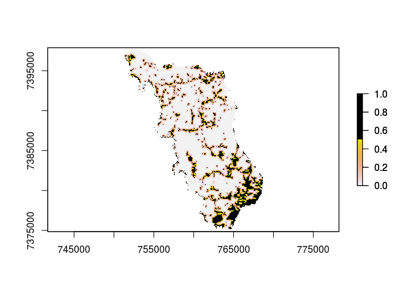

---


Carrega os pacotes 

```r
require(raster)
```

```
## Loading required package: raster
```

```
## Loading required package: sp
```

```r
require(rgdal)
```

```
## Loading required package: rgdal
```

```
## rgdal: version: 1.5-8, (SVN revision 990)
## Geospatial Data Abstraction Library extensions to R successfully loaded
## Loaded GDAL runtime: GDAL 2.2.2, released 2017/09/15
## Path to GDAL shared files: /usr/share/gdal/2.2
## GDAL binary built with GEOS: TRUE 
## Loaded PROJ runtime: Rel. 4.9.2, 08 September 2015, [PJ_VERSION: 492]
## Path to PROJ shared files: (autodetected)
## Linking to sp version:1.4-2
## To mute warnings of possible GDAL/OSR exportToProj4() degradation,
## use options("rgdal_show_exportToProj4_warnings"="none") before loading rgdal.
```

```r
require(dplyr)
```

```
## Loading required package: dplyr
```

```
## 
## Attaching package: 'dplyr'
```

```
## The following objects are masked from 'package:raster':
## 
##     intersect, select, union
```

```
## The following objects are masked from 'package:stats':
## 
##     filter, lag
```

```
## The following objects are masked from 'package:base':
## 
##     intersect, setdiff, setequal, union
```

```r
require(plyr)
```

```
## Loading required package: plyr
```

```
## ------------------------------------------------------------------------------
```

```
## You have loaded plyr after dplyr - this is likely to cause problems.
## If you need functions from both plyr and dplyr, please load plyr first, then dplyr:
## library(plyr); library(dplyr)
```

```
## ------------------------------------------------------------------------------
```

```
## 
## Attaching package: 'plyr'
```

```
## The following objects are masked from 'package:dplyr':
## 
##     arrange, count, desc, failwith, id, mutate, rename, summarise,
##     summarize
```

Aplica MW no raster referente a 2007

```r
r<-raster("./data_use/raster/RASTER_CMA_07.tif")
r2<-r

r2[r2 < 3] <- 0
r2[r2 > 3] <- 0
r2[r2 == 3] <- 1

m<-matrix(1, nrow=11, ncol=11)
r2.focal<-focal(r2, m, fun=mean)
plot(r2.focal)
plot(r2, add=TRUE, col=c("transparent", "black"))
```



Aplica o MW no raster referente a 2017

```r
r017<-raster("./data_use/raster/RASTER_CMA_017.tif")

r3<-r017

r3[r3 < 3] <- 0
r3[r3 > 3] <- 0
r3[r3 == 3] <- 1

m<-matrix(1, nrow=11, ncol=11)
r3.focal<-focal(r3, m, fun=mean)
plot(r3.focal)
plot(r3, add=TRUE, col=c("transparent", "black"))
```


Aqui verificamos quantos existe de area florestada (Falta coisa)

```r
CMA_all<-readOGR(dsn="./data_use",layer="SP_3509452_APP_USO")

ff<-CMA_all@data$CLASSE_USO

ff<-mapvalues(ff, from = c(
  "área antropizada", "área edificada", "silvicultura", 
  "formação florestal", "formação não florestal"), to = c(0,0,0,1,1))
fft<-ff == 1
ab<-disaggregate(CMA_all[fft,])
```

Função para verificar Fragmentos ligados por APP (Falta coisa)

```r
clip.outside<-function(area2clip, clippingArea){
  
  gI <- gIntersects(area2clip, clippingArea, byid = TRUE )
  clip.out.r <- area2clip[ which(gI) , ]
  return(clip.out.r)
}

APP_Ligadas<-clip.outside(,)
```
