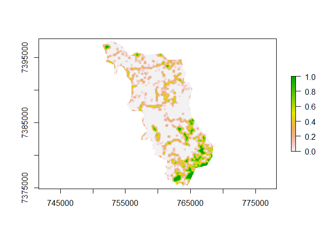

Carrega os pacotes 

```r
require(raster)
```

```
## Loading required package: raster
```

```
## Loading required package: sp
```

```r
require(rgdal)
```

```
## Loading required package: rgdal
```

```
## rgdal: version: 1.4-8, (SVN revision 845)
##  Geospatial Data Abstraction Library extensions to R successfully loaded
##  Loaded GDAL runtime: GDAL 2.2.3, released 2017/11/20
##  Path to GDAL shared files: C:/Users/acmar/Documents/R/win-library/3.6/rgdal/gdal
##  GDAL binary built with GEOS: TRUE 
##  Loaded PROJ.4 runtime: Rel. 4.9.3, 15 August 2016, [PJ_VERSION: 493]
##  Path to PROJ.4 shared files: C:/Users/acmar/Documents/R/win-library/3.6/rgdal/proj
##  Linking to sp version: 1.3-2
```

```r
require(dplyr)
```

```
## Loading required package: dplyr
```

```
## 
## Attaching package: 'dplyr'
```

```
## The following objects are masked from 'package:raster':
## 
##     intersect, select, union
```

```
## The following objects are masked from 'package:stats':
## 
##     filter, lag
```

```
## The following objects are masked from 'package:base':
## 
##     intersect, setdiff, setequal, union
```

```r
require(plyr)
```

```
## Loading required package: plyr
```

```
## ------------------------------------------------------------------------------
```

```
## You have loaded plyr after dplyr - this is likely to cause problems.
## If you need functions from both plyr and dplyr, please load plyr first, then dplyr:
## library(plyr); library(dplyr)
```

```
## ------------------------------------------------------------------------------
```

```
## 
## Attaching package: 'plyr'
```

```
## The following objects are masked from 'package:dplyr':
## 
##     arrange, count, desc, failwith, id, mutate, rename, summarise,
##     summarize
```

Aplica MW no raster referente a 2007

```r
r07<-raster("./data_use/raster/RASTER_CMA_07.tif")

r07[r07 < 3] <- 0
r07[r07 > 3] <- 0
r07[r07 == 3] <- 1

m<-matrix(1, nrow=11, ncol=11)
r07.focal<-focal(r07, m, fun=mean)
```

Plota o MW para 2007

```r
plot(r07.focal)
```


```r
#plot(r07, add=TRUE, col=c("transparent", "black"))
```

Aplica o MW no raster referente a 2017

```r
r17<-raster("./data_use/raster/RASTER_CMA_017.tif")

r17[r17 < 3] <- 0
r17[r17 > 3] <- 0
r17[r17 == 3] <- 1

m<-matrix(1, nrow=11, ncol=11)
r17.focal<-focal(r17, m, fun=mean)
```

Plota o MW para 2017

```r
plot(r17.focal)
```



```r
#plot(r17, add=TRUE, col=c("transparent", "black"))
```

Aqui verificamos quantos existe de area florestada nas APPs (Falta coisa)

```r
CMA_all<-readOGR(dsn="./data_use",layer="SP_3509452_APP_USO")
```

```
## OGR data source with driver: ESRI Shapefile 
## Source: "G:\My Drive\UFSCar\Projetos\teste\APPs_ALPA\data_use", layer: "SP_3509452_APP_USO"
## with 5 features
## It has 6 fields
```

```r
CMA_all@data
```

```
##   GEOCODIGO               MUNICIPIO UF CD_UF                CLASSE_USO
## 0   3509452 CAMPINA DO MONTE ALEGRE SP    35         área antropizada
## 1   3509452 CAMPINA DO MONTE ALEGRE SP    35           área edificada
## 2   3509452 CAMPINA DO MONTE ALEGRE SP    35      formação florestal
## 3   3509452 CAMPINA DO MONTE ALEGRE SP    35 formação não florestal
## 4   3509452 CAMPINA DO MONTE ALEGRE SP    35              silvicultura
##      AREA_HA
## 0 14063.5000
## 1   106.2360
## 2  2078.7000
## 3    73.8172
## 4  1925.9400
```

Calculo APP

```r
cl.uso<-unique(CMA_all@data$CLASSE_USO)

tot.app<-sum(CMA_all@data$AREA_HA)

tot.nat<-CMA_all@data[3,"AREA_HA"]+CMA_all@data[4,"AREA_HA"]
```

Em CMA temos um total de 18248 ha, sendo que apenas 12% encontra-se preservada, um total de 2153 hectares de vegetação nativa.

**Total a ser restaurado = 16096 ha.**


```r
ff<-mapvalues(ff, from = c(
  "área antropizada", "área edificada", "silvicultura", 
  "formação florestal", "formação não florestal"), to = c(0,0,0,1,1))
fft<-ff == 1
ab<-disaggregate(CMA_all[fft,])
```

Função para verificar Fragmentos ligados por APP (Falta coisa)

```r
clip.outside<-function(area2clip, clippingArea){
  
  gI <- gIntersects(area2clip, clippingArea, byid = TRUE )
  clip.out.r <- area2clip[ which(gI) , ]
  return(clip.out.r)
}

APP_Ligadas<-clip.outside(,)
```
