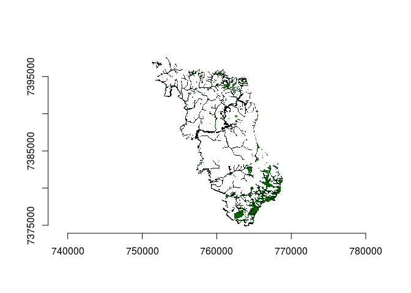

# Introdução

# Distribuição das APPs e Uso 
### Uso do solo

  O município de Campina do Monte Alegre possui área total de 18537Ha, distribuidos em seis classes de uso que podem ser observadas na tabela abaixo, com suas respectivas áreas totais.

     Classe de uso              Área (Ha)
---  -----------------------  -----------
0    água                        271.2170
1    área antropizada          14063.5000
2    área edificada              106.2360
3    formação florestal         2078.7000
4    formação não florestal       73.8172
5    silvicultura               1925.9400

Uso e cobertura do solo de CMA

Florestas de CMA

Uso e cobertura APPs CMA

