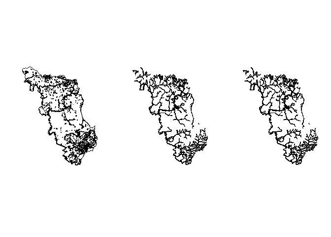

# Introdução
Aqui vamos apenas carregar os mapas baixados da semana passada e plota-los no R

# Passos
Para conseguir usar o comando para a leitura do shapefile será necessário que rgdal esteja instalado e ativo.

```r
install.packages(c('raster', 'sp', 'rgdal', 'dplyr', 'XML', 'curl'))
```

Atente-se ao diretório em que os arquivos estão salvos para evitar erros e não esqueça de executar o download dos mapas novamente usando o script correto.


```r
library(raster)
```

```
## Loading required package: sp
```

```r
library(sp)
library(rgdal)
```

```
## rgdal: version: 1.4-8, (SVN revision 845)
##  Geospatial Data Abstraction Library extensions to R successfully loaded
##  Loaded GDAL runtime: GDAL 2.2.3, released 2017/11/20
##  Path to GDAL shared files: C:/Users/PMD4/Documents/R/R-4.0.0/library/rgdal/gdal
##  GDAL binary built with GEOS: TRUE 
##  Loaded PROJ.4 runtime: Rel. 4.9.3, 15 August 2016, [PJ_VERSION: 493]
##  Path to PROJ.4 shared files: C:/Users/PMD4/Documents/R/R-4.0.0/library/rgdal/proj
##  Linking to sp version: 1.4-1
```

```r
library(dplyr)
```

```
## 
## Attaching package: 'dplyr'
```

```
## The following objects are masked from 'package:raster':
## 
##     intersect, select, union
```

```
## The following objects are masked from 'package:stats':
## 
##     filter, lag
```

```
## The following objects are masked from 'package:base':
## 
##     intersect, setdiff, setequal, union
```

```r
library(XML)
library(curl)

setwd("C:/MAPAS/lab_meet/maps")

#CMA
lista.files.uso.cma = readLines('http://geo.fbds.org.br/SP/CAMPINA_DO_MONTE_ALEGRE/USO/')
```

```
## Warning in readLines("http://geo.fbds.org.br/SP/CAMPINA_DO_MONTE_ALEGRE/
## USO/"): linha final incompleta encontrada em 'http://geo.fbds.org.br/SP/
## CAMPINA_DO_MONTE_ALEGRE/USO/'
```

```r
lista.files.app.cma = readLines('http://geo.fbds.org.br/SP/CAMPINA_DO_MONTE_ALEGRE/APP/')
```

```
## Warning in readLines("http://geo.fbds.org.br/SP/CAMPINA_DO_MONTE_ALEGRE/
## APP/"): linha final incompleta encontrada em 'http://geo.fbds.org.br/SP/
## CAMPINA_DO_MONTE_ALEGRE/APP/'
```

```r
lks.lista<-c(lista.files.uso.cma,lista.files.app.cma)
lks<-getHTMLLinks(lks.lista, xpQuery = "//a/@href[contains(., 'SP')]")
for (i in 1:(length(lks))){
  destf<-paste("./data_use", strsplit(lks[i], "/")[[1]][5], sep="/")
  curl_download((paste("http://geo.fbds.org.br", lks[i], sep="")),destfile = destf)
}
```

Aqui começamos a carregar os mapas para o R. O comando responsável em carregar o shapefile como SpatialPolygonsDataFrame para dentro do R é o readOGR.


```r
CMA_uso<-readOGR(dsn="./data_use",layer="SP_3509452_USO")
```

```
## OGR data source with driver: ESRI Shapefile 
## Source: "C:\MAPAS\lab_meet\maps\data_use", layer: "SP_3509452_USO"
## with 6 features
## It has 6 fields
```

```r
CMA_app<-readOGR(dsn="./data_use",layer="SP_3509452_APP")
```

```
## OGR data source with driver: ESRI Shapefile 
## Source: "C:\MAPAS\lab_meet\maps\data_use", layer: "SP_3509452_APP"
## with 5 features
## It has 7 fields
## Integer64 fields read as strings:  GEOCODIGO
```

```r
CMA_all<-readOGR(dsn="./data_use",layer="SP_3509452_APP_USO")
```

```
## OGR data source with driver: ESRI Shapefile 
## Source: "C:\MAPAS\lab_meet\maps\data_use", layer: "SP_3509452_APP_USO"
## with 5 features
## It has 6 fields
```

Nota-se que o "dsn" é o diretório do arquivo, sem o nome do shapefile, que deve ser colocado no "layer" sem a extensão. Isso faz com que todos os arquivos com o mesmo nome sejam carregados, pegando dessa forma todas as informações necessárias.

Para a visualização dos mapas basta usar o comando plot(obj), sendo o "obj" o objeto em que o mapa foi salvo dentro do R

<!-- -->
